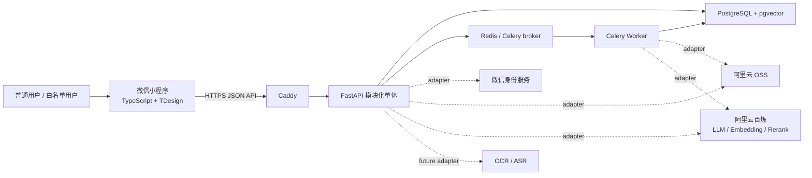
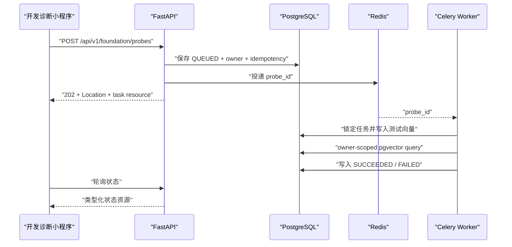

# ProbeInterview Architecture

本文描述 ProbeInterview 的项目级目标架构与当前约束。OpenSpec change 决定每次交付的功能范围；ADR 记录技术决策理由；本文只汇总当前有效结论。

当前首先交付 `setup-foundation` walking skeleton。知识导入、知识关联、卡片、模拟面试和报告仍是后续 changes，不应因为出现在目标架构中就加入 foundation。

## 1. 系统上下文

候选人通过微信小程序学习知识、上传资料、参加模拟面试并查看报告。白名单用户仍使用同一入口，只额外获得发布公共知识的能力。

应用代码只依赖内部端口和 `ActorContext`，不直接依赖供应商 SDK。`setup-foundation` 对 OSS、LLM 和 Embedding 使用确定性 fake，不调用真实云服务。

相关决策：[ADR 0001](adr/0001-project-structure-and-technology-stack.md)、[ADR 0004](adr/0004-api-and-identity-boundary.md)、[ADR 0006](adr/0006-external-adapters-and-verification-strategy.md)。

## 2. 容器与部署

MVP 部署在单台阿里云 ECS，由 Docker Compose 编排。

| Runtime | Responsibility | Communication |
|---|---|---|
| Caddy | 公网入口、反向代理、TLS 和 HTTP 到 HTTPS 跳转 | HTTPS → FastAPI |
| FastAPI API | 同步 API、事务、身份与权限、低延迟业务编排 | PostgreSQL、Redis、外部端口 |
| Celery Worker | 文件解析、Embedding、知识关联、长时评分及失败重试 | Redis、PostgreSQL、外部端口 |
| PostgreSQL + pgvector | 业务状态、版本、owner 隔离、向量派生数据 | SQL |
| Redis | Celery broker，不保存最终业务真相 | Celery protocol |

API 与 Worker 使用同一后端镜像和代码包，通过不同命令启动。Compose 必须使用健康检查和显式重试；测试使用隔离且可清理的数据卷。

单 ECS 不提供高可用，这是 MVP 为控制成本接受的取舍。数据库、队列或网关迁移到托管服务时，不应改变应用层接口。

相关决策：[ADR 0003](adr/0003-asynchronous-job-architecture.md)、[ADR 0005](adr/0005-deployment-and-runtime-operations.md)。

## 3. 后端模块划分

后端是按业务模块组织的模块化单体。每个模块内部按需要划分 `domain`、`application`、`api` 和 `infrastructure`。

| Module | Responsibility | Allowed dependencies |
|---|---|---|
| platform/foundation | 配置、日志、数据库、任务、API 基础协议及外部服务端口 | 不依赖业务模块 |
| identity/access | 微信身份映射、`ActorContext`、capability 和 owner scope | platform |
| knowledge-source | 上传来源、解析版本、原文引用和处理状态 | identity、platform |
| knowledge-concept | 主题树、知识点、公共/个人关联和冲突判断 | knowledge-source 的应用契约 |
| knowledge-card | 从知识概念生成和展示问答卡片 | knowledge-concept 的查询契约 |
| interview | 配置快照、选题、面试轮次和受控追问 | knowledge 查询端口、identity |
| assessment/review | 证据评分、报告、短板和复盘批次 | interview 的不可变结果契约 |

禁止的依赖：

- 业务模块直接导入其他模块的 repository 或 ORM model；
- domain/application 直接导入 OSS、百炼、微信或其他供应商 SDK；
- API handler 绕过应用服务直接写数据库；
- 公共与个人知识使用两套互不兼容的领域模型；
- Redis、Celery result backend 或向量记录成为最终业务真相。

跨模块调用使用应用服务契约、端口或明确的领域事件。拆分服务前必须先证明模块边界、容量或团队发布节奏已形成实际需求。

相关决策：[ADR 0001](adr/0001-project-structure-and-technology-stack.md)、[ADR 0002](adr/0002-data-and-rag-foundation-boundary.md)。

## 4. 核心数据流

### 4.1 Foundation walking skeleton

该流程只验证运行单元和契约，不创建任何知识、卡片或面试实体。

### 4.2 知识入库与卡片

后续 change 将按以下方向实现：上传 XMind/Markdown → 保存原始来源和版本 → 异步解析 → 生成候选知识点与内容片段 → 规则/检索先筛选候选 → 仅对歧义关联调用 LLM → 激活新版本的派生向量 → 生成知识卡片。公共知识与个人知识走同一结构，以范围标签、owner 和 capability 区分。

原始来源与版本是事实依据，Embedding 可以按模型版本重新生成。图片和附件内容暂不进入知识库。

### 4.3 模拟面试与复盘

```mermaid
flowchart LR
    Config["简历 / JD / 年限 / 时长"] --> Snapshot["不可变配置快照"]
    Snapshot --> Retrieval["公共 + 个人知识受控召回"]
    Retrieval --> Plan["面试计划与问题快照"]
    Plan --> Question["展示问题"]
    Question --> Answer["语音或文本回答"]
    Answer --> Transcript["ASR 转写与用户确认"]
    Transcript --> Followup["受控追问 / 下一题"]
    Followup --> Assessment["证据评分"]
    Assessment --> Report["面试报告"]
    Report --> Weakness["用户选择短板"]
    Weakness --> Review["复盘批次与知识卡片"]
```

每场面试引用不可变的知识、Prompt、模型和规则版本，保证后续报告可解释。OCR/ASR 服务商、实时语音传输和 Agent 工作流实现仍是后续 change 的 Open 决策。

相关决策：[ADR 0002](adr/0002-data-and-rag-foundation-boundary.md)、[ADR 0003](adr/0003-asynchronous-job-architecture.md)、[ADR 0006](adr/0006-external-adapters-and-verification-strategy.md)。

## 5. 横切关注点

- **身份与隔离**：应用层使用 `ActorContext(actor_id, capabilities)`；owner 和公共范围条件必须在数据库/向量查询前应用。白名单只增加公共知识发布 capability。
- **版本与快照**：上传来源、解析结果、Embedding、知识内容、面试配置、问题和评估规则均通过显式版本关联；派生数据不得覆盖事实来源。
- **HTTP 契约**：成功直接返回类型化资源；错误使用 RFC 9457 Problem Details；异步创建返回 `202 + Location`；命令使用 `Idempotency-Key`。
- **Trace**：Request ID 贯穿 HTTP，Trace ID 关联跨进程调用，Job ID 定位后台任务。关键业务事件必须关联使用的内容、模型和规则版本。
- **结构化模型输出**：LLM 输出必须通过 Pydantic schema 校验；模型不能绕过权限、状态机或直接执行任意代码。
- **隐私**：普通日志不记录上传正文、私人知识、请求正文、完整 Prompt/模型响应、令牌或连接串。临时音频在转写确认后按产品保留策略删除。

相关决策：[ADR 0004](adr/0004-api-and-identity-boundary.md)、[ADR 0005](adr/0005-deployment-and-runtime-operations.md)、[ADR 0006](adr/0006-external-adapters-and-verification-strategy.md)。

## 6. 质量属性与取舍

| Attribute | MVP target | Accepted trade-off |
|---|---|---|
| 成本 | 单 ECS、PostgreSQL + pgvector、共享后端镜像 | 不提供高可用与独立扩缩容 |
| 可恢复性 | 长任务持久化状态、有限重试、幂等和 QUEUED 恢复 | 暂不实现完整 transactional outbox |
| 延迟 | 低延迟交互留在 API；解析、Embedding 和长评分异步执行 | 客户端需要轮询后台状态 |
| 可追溯性 | 来源、版本、request/trace/job 和评估证据可关联 | 增加版本字段与存储成本 |
| 隐私 | owner 前置过滤、日志脱敏、临时数据删除 | 排障不能依赖直接记录原文 |
| 可测试性 | 确定性 fake + 真实本地数据库/队列 E2E | foundation 测试不证明模型质量 |

根级 `scripts/verify` 将成为本地和 CI 的唯一完整验证入口；在 `setup-foundation` 实现前该命令尚不存在。CI 托管平台不影响验证契约。

相关决策：[ADR 0003](adr/0003-asynchronous-job-architecture.md)、[ADR 0005](adr/0005-deployment-and-runtime-operations.md)、[ADR 0006](adr/0006-external-adapters-and-verification-strategy.md)。

## 7. 演进点

| Trigger | Evolution | Required decision |
|---|---|---|
| 单 ECS 无法满足容量或可用性目标 | 迁移托管数据库/队列、拆分运行单元或引入编排平台 | 新 ADR |
| 后台流程需要多步骤补偿或严格投递保证 | 引入 outbox 或工作流引擎 | 新 ADR |
| pgvector 在真实规模下无法满足召回或隔离要求 | 调整索引或评估专用向量库 | 更新/替代 ADR 0002 |
| 模块形成独立团队、发布节奏或扩缩容需求 | 从模块化单体拆分服务 | 新 ADR |
| 确定 OCR/ASR、Agent 编排或 CI 托管平台 | 增加对应 adapter/workflow 决策 | 新 ADR 或补充项目配置 |
| 引入新的语言、框架、数据库、云服务或主要依赖 | 先讨论其必要性与替代方案 | 新 ADR |

目标架构视觉参考位于 [docs/design/visuals](design/visuals/README.md)。其中标记为 reference 或 pending 的内容不构成已接受决策；有效结论以本文件和 [ADR 索引](adr/README.md) 为准。

