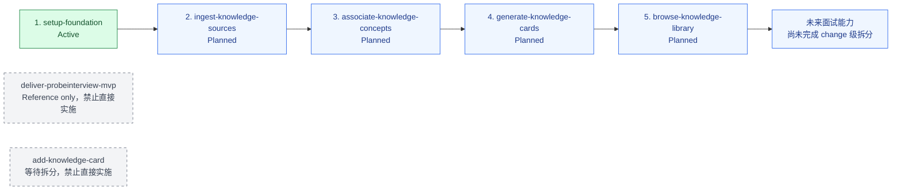

# ProbeInterview MVP 项目路线图

更新时间：2026-09-28

## 1. 文档目的

本路线图只管理 MVP 的实施顺序、change 依赖、当前状态与准入门槛。功能需求以 OpenSpec proposal/specs/design/tasks 为准；项目级技术决策以 [architecture.md](architecture.md) 和 [ADR 索引](adr/README.md) 为准；流程约束参考 [playbook.md](playbook.md) 与 [OpenSpec 配置](../openspec/config.yaml)。

最终目标是交付一个证据驱动、可评估、可重放的 AI 面试训练系统：将回答证据映射到知识缺口，通过受控 Agent 工作流生成复盘任务，并以版本化评估集持续监控评分漂移和失败分布。

## 2. 状态定义

| 状态 | 含义 |
|---|---|
| Reference | 只用于需求追溯或拆分参考，禁止直接实施 |
| Planned | 顺序与方向已记录，但尚未满足实施准入条件 |
| Active | 当前允许开始或继续实施的 change；同一时刻原则上只有一个 |
| Implemented | 代码、测试和任务已完成，但尚未完成 OpenSpec 归档 |
| Archived | 已通过验收并归档；只有此状态可以解锁依赖它的 change |

状态通常按 `Planned → Active → Implemented → Archived` 推进。`Reference` 不进入实施状态流。

## 3. Change 依赖图

实线箭头表示“前置 change 必须先归档，后续 change 才能实施”。

`deliver-probeinterview-mvp` 和 `add-knowledge-card` 在图中是治理提示，不是可实施节点，也不是实线依赖。

## 4. 执行顺序

当前唯一允许开始实施的 change 是 `setup-foundation`。每个后续 change 只有在所有依赖 change 均为 `Archived`、自身 OpenSpec artifacts 已确认且不存在阻塞实施的 Open 项时，才可进入 `Active`。

| change / 阶段 | 状态 | 一句话范围 | 依赖项 | 进入条件 | 完成条件 |
|---|---|---|---|---|---|
| `deliver-probeinterview-mvp` | Reference | 保留完整 MVP 需求与场景作为追溯材料，不采用其旧技术方案 | 无 | 仅在拆分或核对需求时读取 | 不直接实施；后续 change 对所需需求完成归属与覆盖 |
| `add-knowledge-card` | Planned（等待拆分） | 作为知识导入、关联、卡片和浏览能力的拆分来源 | `setup-foundation` 提供基础约束 | 拆分方案与需求归属获得用户明确确认 | 四个后续知识 change 的 artifacts 和需求对账完成；本 change 仍不得直接实施 |
| `setup-foundation` | **Active** | 建立小程序、API、数据库、队列、Worker、pgvector 与统一验证入口的最薄 walking skeleton | 无 | 规划已完成且无阻塞 Open 项 | 12/12 tasks 完成；全部 scenarios 有自动化覆盖；运行与验证命令已文档化；change 已归档 |
| `ingest-knowledge-sources` | Planned | 接收并解析 XMind/Markdown，保存 owner-scoped 原始来源、不可变版本、树/片段、状态、重试与删除生命周期 | `setup-foundation` | 前置 change 已归档；本 change 的 proposal/specs/design/tasks 已确认并通过校验；文件限制与处理预算无阻塞项 | 来源与版本全生命周期及权限场景通过自动化验收；change 已归档 |
| `associate-knowledge-concepts` | Planned | 将可见来源片段映射到稳定知识概念和统一主题，处理新增、相同、扩展、冲突及人工确认 | `ingest-knowledge-sources` | 前置 change 已归档；切分、Embedding、索引、候选阈值和确认策略已在本 change 中确认 | 关联准确性、冲突处理、版本复用和 owner 前置过滤均有自动化覆盖；change 已归档 |
| `generate-knowledge-cards` | Planned | 从已确认概念与来源生成可追溯、版本化、可编辑且明确标注 AI 补全/冲突的知识卡片 | `associate-knowledge-concepts` | 前置 change 已归档；卡片结构、溯源粒度、人工编辑覆盖和公共发布规则无阻塞项 | 来源优先生成、版本更新、人工编辑、公共确认和冲突保留场景通过；change 已归档 |
| `browse-knowledge-library` | Planned | 提供统一主题、首页卡片、详情、学习状态及受 scope 约束的关键词/向量搜索 | `generate-knowledge-cards` | 前置 change 已归档；浏览、搜索、学习状态与 UI 状态已形成已确认 change | 浏览、搜索、学习状态、归档过滤和跨 owner 隔离场景通过；change 已归档 |

## 5. 顺序与并行原则

知识卡片阶段不安排 change 级并行：导入阶段定义来源与版本真相；关联阶段消费来源片段并产生稳定概念；生成阶段消费已确认概念；浏览阶段消费已发布卡片与有效索引。任何阶段提前实施都会依赖尚未归档的数据契约或未确认的 RAG 参数。

可以在单个 change 内按其 tasks 安排独立工作的并行开发，但不得绕过“前置 change 已归档”的实施门槛。未来面试能力是否可并行，必须等 change 级拆分和依赖确认后再决定。

## 6. 未来面试阶段（尚未拆分）

以下仅是知识卡片阶段之后的能力方向，不是正式 change 名称，也不表示范围已经确认：

1. 面试配置与不可变输入快照：简历、工作年限、公司/JD、语言、时长及内容/模型/规则版本。
2. 模拟面试执行：受控选题、文字提问、语音转写确认、证据驱动追问、时间与异常结束。
3. 证据评估与报告：能力评分、证据引用、覆盖不足、优势、短板和逐题反馈。
4. 回放与追溯：稳定事件、输入快照、证据关系和版本链；产品化回放界面范围另行确认。
5. 复盘闭环：用户确认短板、按面试组织复盘、关联知识卡片，并由受控 Agent 生成复盘任务。
6. 离线评估与质量监控：版本化评估集、人工锚点、评分漂移、失败分布、成本与延迟比较。

这些能力必须先完成 OpenSpec 拆分、需求归属和设计确认，才能加入正式实施顺序。

## 7. 维护规则

- Roadmap 不替代 OpenSpec，也不在此定义新的功能需求或技术方案。
- 每个 change 实施前必须确认：全部依赖已归档、自身设计不存在阻塞 Open 项、每个 requirement scenario 都有计划中的自动化覆盖。
- `Implemented` 不足以解锁下游；只有 `Archived` 可以作为已满足依赖。
- `openspec list --json` 的 `in-progress` 是目录任务状态，不等同于本路线图的实施授权状态。
- 每个 change 归档后更新本路线图；新增、重排或拆分 change 必须获得用户明确确认，用户沉默不代表确认。
