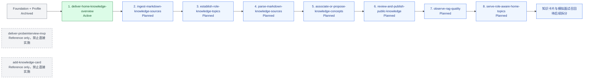

# ProbeInterview MVP 项目路线图

更新时间：2026-09-29

## 1. 文档目的

本路线图只管理 MVP 的实施顺序、change 依赖、当前状态与准入门槛。功能需求以 OpenSpec proposal/specs/design/tasks 为准；项目级技术决策以 [architecture.md](architecture.md) 和 [ADR 索引](adr/README.md) 为准；流程约束参考 [playbook.md](playbook.md) 与 [OpenSpec 配置](../openspec/config.yaml)。

最终目标是交付一个证据驱动、可评估、可重放的 AI 面试训练系统：将回答证据映射到知识缺口，通过受控 Agent 工作流生成复盘任务，并以版本化评估集持续监控评分漂移和失败分布。

## 2. 状态定义

| 状态 | 含义 |
|---|---|
| Reference | 只用于需求追溯或拆分参考，禁止直接实施 |
| Planned | 顺序与方向已记录，但尚未满足实施准入条件 |
| Active | 当前允许开始或继续实施的 change；同一时刻原则上只有一个 |
| Implemented | 代码、测试和任务已完成，但尚未完成 OpenSpec 归档 |
| Archived | 已通过验收并归档；只有此状态可以解锁依赖它的 change |

状态通常按 `Planned → Active → Implemented → Archived` 推进。`Reference` 不进入实施状态流。

## 3. Change 依赖图

实线箭头表示“前置 change 必须先归档，后续 change 才能实施”。

知识上传 MVP 的整体共识记录在
[knowledge-upload-mvp-overview.md](knowledge-upload-mvp-overview.md)。该文档解释方向，不替代各 change 的 OpenSpec artifacts。

## 4. 执行顺序

`setup-foundation`、`establish-runtime-api-foundation`、`establish-trace-context-propagation` 和 `deliver-my-profile-overview` 已归档。当前只允许 `deliver-home-knowledge-overview` 进入实施；每个后续 change 只有在前置 change 已归档、自身 artifacts 已确认且不存在阻塞实施的 Open 项时，才可进入 `Active`。

| change / 阶段 | 状态 | 一句话范围 | 依赖项 | 进入条件 | 完成条件 |
|---|---|---|---|---|---|
| `deliver-probeinterview-mvp` | Reference | 保留完整 MVP 需求与场景作为追溯材料，不采用其旧技术方案 | 无 | 仅在拆分或核对需求时读取 | 不直接实施；后续 change 对所需需求完成归属与覆盖 |
| `add-knowledge-card` | Reference | 保留早期知识卡片设想作为追溯材料，不直接实施 | 无 | 仅在拆分或核对需求时读取 | 不直接实施 |
| `setup-foundation` | Archived | 建立 monorepo、类型化配置和最小工程骨架 | 无 | 已完成 | 已归档 |
| `establish-runtime-api-foundation` | Archived | 建立 API、Worker、PostgreSQL、Redis、网关和基础协议 | `setup-foundation` | 已完成 | 已归档 |
| `establish-trace-context-propagation` | Archived | 建立 request、trace 和 job 上下文传播基础 | `establish-runtime-api-foundation` | 已完成 | 已归档 |
| `deliver-my-profile-overview` | Archived | 建立当前用户、默认目标岗位、owner 隔离和五 tab 页面骨架 | runtime foundation | 已完成 | 已归档 |
| `deliver-home-knowledge-overview` | **Active** | 按视觉稿实现首页；昵称读取真实概览，其余内容使用确定性 fake | `deliver-my-profile-overview` | artifacts 已确认并通过校验 | 加载、成功、错误、fake 内容和无副作用交互均有自动化覆盖；change 已归档 |
| `ingest-markdown-knowledge-sources` | Planned | 真实上传 Markdown 到 OSS，保存统一 public/private 来源、版本、能力、配额和列表状态 | `deliver-home-knowledge-overview` | 前置 change 已归档；OSS adapter、500 KiB 校验、每日 2 文件配额和保留策略已确认 | 上传、重复、配额、权限、owner 隔离和存储失败场景通过；change 已归档 |
| `establish-role-knowledge-topics` | Planned | 建立六个主题、稳定岗位及知识点岗位映射结构，不预置业务知识点 | `ingest-markdown-knowledge-sources` | 前置 change 已归档；主题和岗位模型已确认 | 主题、岗位归一化、映射版本和 capability 场景通过；change 已归档 |
| `parse-markdown-knowledge-sources` | Planned | 异步解析 Markdown 标题层级和章节，维护处理与发布状态及重试 | `establish-role-knowledge-topics` | 前置 change 已归档；解析边界和资源预算已确认 | 确定性解析、幂等、失败恢复、状态和清理场景通过；change 已归档 |
| `associate-or-propose-knowledge-concepts` | Planned | 受控 Agent 使用别名、pgvector 和结构化 LLM 关联已有知识点或提出新知识点 | `parse-markdown-knowledge-sources` | 前置 change 已归档；模型、Prompt、confidence 校准和 eval 入口已确认 | 关联、新建提议、冲突、scope、trace-lite、eval 和 badcase 场景通过；change 已归档 |
| `review-and-publish-public-knowledge` | Planned | reviewer 在小程序确认公共关联、新知识点和冲突并驱动 ACTIVE 发布 | `associate-or-propose-knowledge-concepts` | 前置 change 已归档；审核动作和发布门槛已确认 | capability、审核决策、幂等发布和审计场景通过；change 已归档 |
| `observe-rag-quality` | Planned | 为 reviewer 展示 confidence 校准、准确率、badcase、版本、费用和延迟 | `review-and-publish-public-knowledge` | 已有真实审核数据和版本化 run 数据 | 指标口径、版本对比和 owner/管理员权限场景通过；change 已归档 |
| `serve-role-aware-home-topics` | Planned | 用当前 target role、可见 scope 和 ACTIVE 关联替换首页“按主题学习”fake 数据 | `observe-rag-quality` | 前置 change 已归档；首页统计口径已确认 | 真实分类、去重计数、岗位过滤、空态和跨 owner 隔离通过；change 已归档 |

## 5. 顺序与并行原则

知识上传阶段不安排 change 级并行：首页视觉先建立已确认页面边界；导入定义来源和权限真相；主题与岗位定义稳定分类；解析产生版本化章节；关联消费章节并产生概念；审核决定公共发布；质量页消费真实审核结果；最后首页消费 ACTIVE 知识读模型。任何阶段提前实施都会依赖尚未归档的数据契约。

可以在单个 change 内按其 tasks 安排独立工作的并行开发，但不得绕过“前置 change 已归档”的实施门槛。未来面试能力是否可并行，必须等 change 级拆分和依赖确认后再决定。

## 6. 未来面试阶段（尚未拆分）

以下仅是知识卡片阶段之后的能力方向，不是正式 change 名称，也不表示范围已经确认：

1. 面试配置与不可变输入快照：简历、工作年限、公司/JD、语言、时长及内容/模型/规则版本。
2. 模拟面试执行：受控选题、文字提问、语音转写确认、证据驱动追问、时间与异常结束。
3. 证据评估与报告：能力评分、证据引用、覆盖不足、优势、短板和逐题反馈。
4. 回放与追溯：稳定事件、输入快照、证据关系和版本链；产品化回放界面范围另行确认。
5. 复盘闭环：用户确认短板、按面试组织复盘、关联知识卡片，并由受控 Agent 生成复盘任务。
6. 离线评估与质量监控：版本化评估集、人工锚点、评分漂移、失败分布、成本与延迟比较。

这些能力必须先完成 OpenSpec 拆分、需求归属和设计确认，才能加入正式实施顺序。

## 7. 维护规则

- Roadmap 不替代 OpenSpec，也不在此定义新的功能需求或技术方案。
- 每个 change 实施前必须确认：全部依赖已归档、自身设计不存在阻塞 Open 项、每个 requirement scenario 都有计划中的自动化覆盖。
- `Implemented` 不足以解锁下游；只有 `Archived` 可以作为已满足依赖。
- `openspec list --json` 的 `in-progress` 是目录任务状态，不等同于本路线图的实施授权状态。
- 每个 change 归档后更新本路线图；新增、重排或拆分 change 必须获得用户明确确认，用户沉默不代表确认。
